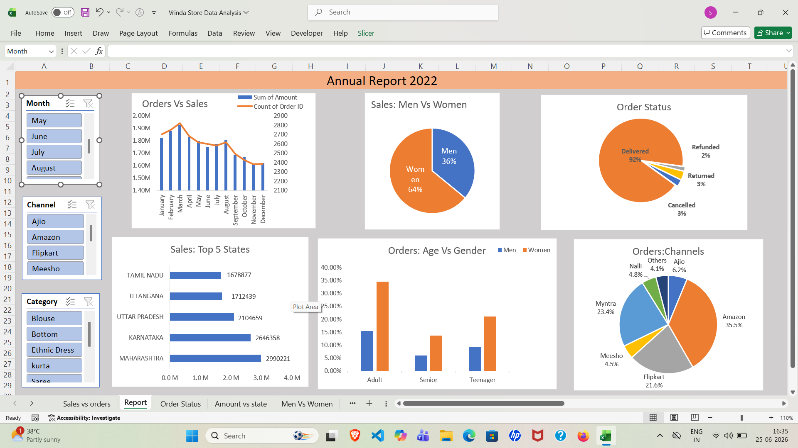

# Excel Sales Dashboard

## Overview

This project is an interactive Sales Dashboard built using Microsoft Excel and the Vrinda Store Dataset.

## Tools Used

* Microsoft Excel
* Pivot Tables
* Pivot Charts
* Slicers

## Key KPIs

* Total Sales
* Total Orders
* Sales by Gender
* Sales by Age Group
* Sales by State
* Order Status Analysis

## Features

* Interactive filters using slicers
* Dynamic charts and visualizations
* Business insights from sales data
* Easy-to-understand dashboard design

## Dataset

Vrinda Store Sales Dataset

## Dashboard Preview

Dashboard screenshots will be added here.
## Dashboard Preview

